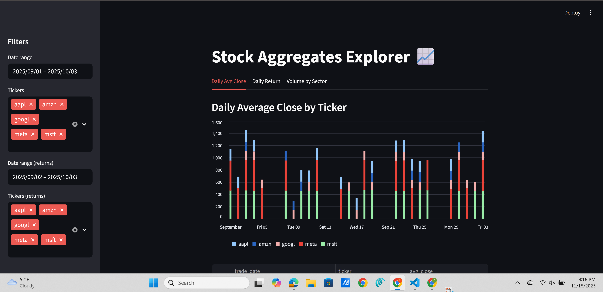
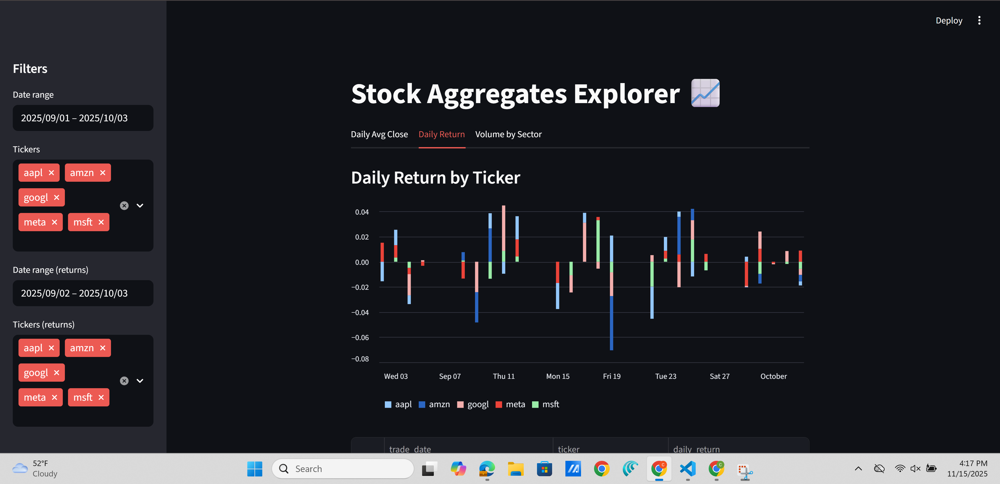
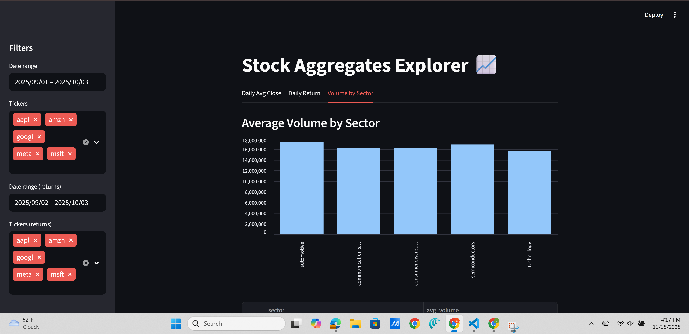

# 📈 Stock Market Data Pipeline & Streamlit Dashboard

This project ingests a raw `stock_market.csv`, performs cleaning and validation, builds analytical aggregates, and exposes a Streamlit dashboard for quick exploration.

The README below gives a compact Quick Start, the pipeline steps, produced artifacts, and a few notes to help you run it locally.

---

## 🚀 Quick Start

1. Create (or activate) a Python environment with a supported version (Python 3.9+ recommended).
2. Install the lightweight dependencies:

```bash
pip install pandas pyarrow streamlit
```

3. Run the pipeline steps (clean → aggregate → dashboard):

```bash
# Clean the raw CSV and produce cleaned.parquet
python api/cleaning.py

# Build the aggregate parquet files
python api/aggregates.py

# Start the Streamlit dashboard
streamlit run app.py
```

---

## 🧭 What this pipeline does

High-level flow:

- Input: `api/stock_market.csv` (raw)
- Step 1: Normalize and validate the raw CSV → `cleaned.parquet`
- Step 2: Build analytic aggregates (parquet files)
- Step 3: Launch Streamlit dashboard to visualize results

### Step 1 — Clean the raw CSV

Command:

```bash
python api/cleaning.py
```

Cleaning features:

- Convert column names to `snake_case`
- Trim whitespace and lowercase textual fields
- Normalize common missing-value tokens (`na`, `-`, `null`, etc.)
- Enforce a schema for key columns (date, float, int, string, boolean)
- Output: `cleaned.parquet`

### Step 2 — Build aggregates

Command:

```bash
python api/aggregates.py
```

Produced artifacts (Parquet files):

- `agg_daily_avg_close.parquet` — average close price per day per ticker
- `agg_avg_volume_sector.parquet` — average trading volume by sector
- `agg_daily_return.parquet` — daily return (% change of close price)

These are lightweight, columnar files suitable for fast reads in analytics or feeding the dashboard.

### Step 3 — Launch the Streamlit Dashboard

Command (from repository root):

```bash
streamlit run app.py
```

Dashboard features:

- Daily Avg Close (interactive bar chart with filters)
- Daily Return (bar chart + filters)
- Volume by Sector (bar chart)

---

## ✅ Notes & Tips

- Recommended Python: 3.9+.
- If you prefer isolating the environment, use `python -m venv .venv` then `source .venv/bin/activate` (or the Windows equivalent).
- For reproducible installs, consider adding a `requirements.txt` with pinned versions.
- If the source CSV is very large, run the cleaning step on a machine with sufficient memory or adapt `api/cleaning.py` to stream/process in chunks.

## Files of interest

- `api/cleaning.py` — cleaning & validation logic
- `api/aggregates.py` — aggregation and output writers
- `app.py` — Streamlit app that reads the parquet artifacts and renders charts


## 🖼️ Screenshots (Streamlit dashboard)

Below are example screenshots from the dashboard. Replace these files in `images/` with your own screenshots if you want different images to appear in this README.

### Dashboard overview



### Daily Avg Close (example)



### Volume by Sector (example)




